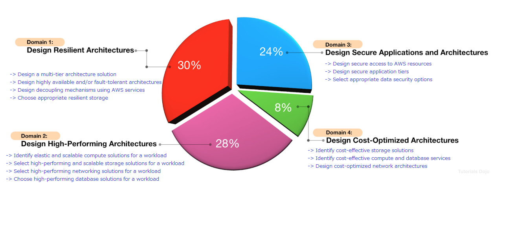
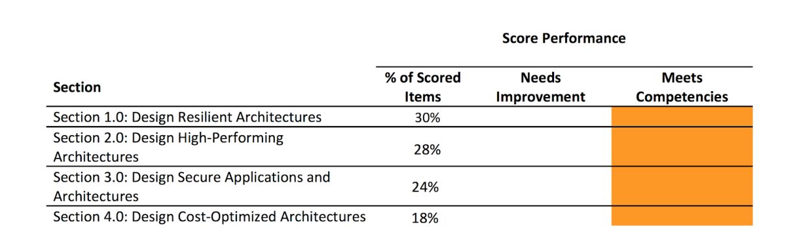

# Solution Architect Associate(SAA)-Exam Overview
- 2013: Initial release certification system.
- 2018 February: launch an updated version of the AWS Certified Solutions Architect - Associate certification with an exam code of SAA-C01. 
- 2020 March: AWS released yet another version of the exam (SAA-C02).

## Exam detail
| Title            | Content                                              |
| :--------------- | ---------------------------------------------------- |
| Exam Code        | SAA-C02                                              |
| Release Date     | March 2020                                           |
| Prerequisites    | None                                                 |
| Target           | For who perform a Solutions Architect or DevOps role |
| No. of Questions | 65                                                   |
| Score Range      | 100-1000                                             |
| Cost             | 150 USD (Practice exam: 20 USD)                      |
| Passing Score    | 720/1000                                             |
| Time Limit       | 2 hours 10 minutes (130 minutes)                     |
| Format           | Scenario-based. Multiple choice/multiple answers.    |
| Delivery Method  | Testing center or online proctored exam              |

> Don’t be confused if you see in your Pearson Vue booking that the duration is 140 minutes since they included an additional 10 minutes for reading the Non-Disclosure Agreement (NDA) at the start of the exam and the survey at the end of it. If you booked in PSI, the exam duration time that you will see is 130 minutes.

## Exam domains

## Exam Score System

**Score Range**: 100-1000

**Passing Score**: 720/1000

**Working way**: using a scaled scoring model to equate scores across multiple exam types that may have different difficulty levels.

**Result**: You’ll immediately see a pass or fail notification on the testing screen when you finish the exam. A `“Congratulations! You have successfully passed...”` message will be shown if you passed the exam.

**Result report**: 
- The complete score report will be sent to you by email after a few days.
- The score report contains a table of your performance at each section/domain, which indicates whether you met the competency level required for these domains or not.
- AWS is using a compensatory scoring model, which means that you do not need to pass each and every individual section, only the overall examination.
- Each section has a specific score weighting that translates to the number of questions; hence, some sections have more questions than others. 
- The Score Performance table highlights your strengths and weaknesses that you need to improve on.
 

**Re-take**: 
 - if you not pass, need to wait 14 days to retake the exam. 
 - un-limit on exam attempts (until you pass the exam).

## Exam Benefits
If you successfully passed any AWS exam, you will be eligible for the following benefits: 

● **Exam Discount** - You’ll get a 50% discount voucher that you can apply for your recertification or any other exam you plan to pursue. To access your discount voucher code, go to the “Benefits” section of your AWS Certification Account, and apply the voucher when you register for your next exam. 

● **Free Practice Exam** - To help you prepare for your next exam, AWS provides another voucher that you can use to take any official AWS practice exam for free. You can access your voucher code from the “Benefits” section of your AWS Certification Account. 

● **AWS Certified Store** - All AWS certified professionals will be given access to exclusive AWS Certified merchandise. You can get your store access from the “Benefits” section of your AWS Certification Account. 

● **Certification Digital Badges** - You can showcase your achievements to your colleagues and employers with digital badges on your email signatures, Linkedin profile, or on your social media accounts. You can also show your Digital Badge to gain exclusive access to Certification Lounges at AWS re:Invent, regional Appreciation Receptions, and select AWS Summit events. To view your badges, simply go to the “Digital Badges” section of your AWS Certification Account.
